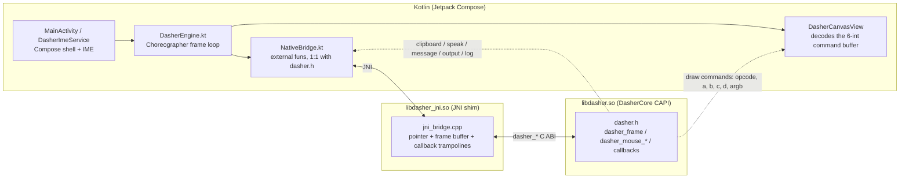

# Dasher for Android

[](https://github.com/dasher-project/Dasher-Android/actions/workflows/build.yml)
[](https://github.com/dasher-project/Dasher-Android/releases)
[](./LICENSE)

Dasher is an information-efficient text-entry interface, driven by continuous
pointing gestures. It lets you write using eye gaze, a mouse, a switch, a
joystick, or touch — designed for accessibility and augmentative communication
(AAC).

This is the **Android** frontend, built on the shared
[DasherCore](https://github.com/dasher-project/DasherCore) engine.

> **[dasher.at](https://dasher.at)** — downloads, user docs, and live demo
> **[Feature status](https://dasher.at/status/)** — what each platform supports
> **[All repos](https://github.com/dasher-project)** — engine, frontends, design guide

## Status

> **Preview** — actively developed. Not on Google Play yet; download the latest
> signed APK from [Releases](../../releases) and sideload it. See the
> [feature matrix](https://dasher.at/status/) for what's implemented.

## Install

Download the latest APK from [Releases](../../releases) and install it
(Settings → Apps → allow unknown sources for your browser, then open the APK).
To use Dasher as the system keyboard, enable it in
**Settings → System → Keyboard → On-screen keyboard** and select it as the
default input method.

## Build

### Prerequisites

- Android Studio (Ladyfish or newer) — supplies JDK 17, the Android SDK, and the NDK
- Android SDK 35, NDK 27.0.12077973, CMake 3.22.1 (Android Studio offers to install these on first open)
- Git (with submodules)

### Steps

```bash
git clone --recurse-submodules https://github.com/dasher-project/Dasher-Android.git
cd Dasher-Android
./gradlew :app:assembleDebug
```

Or open the project in Android Studio and run the `app` configuration on a
device or emulator (API 24+, x86_64 or arm64-v8a). On first open, Android
Studio installs the SDK/NDK/CMake and initialises the `DasherCore` submodule.

## Architecture

DasherCore is consumed through its public C ABI (`dasher.h`) — the same
integration pattern as Dasher-Windows. A thin JNI shim (`libdasher_jni.so`)
marshals the per-frame draw-command buffer, pointer input, and engine callbacks
(clipboard / speak / message / output / log) between Kotlin and `libdasher.so`.
The UI is Jetpack Compose; the same engine drives both the standalone app
(`MainActivity`) and the system keyboard (`DasherImeService`).



Each draw command is 6 ints: `[opcode, a, b, c, d, argb]` (clear / circle / line /
rect-outline / rect-fill / text). Pointer events flow the other way
(`DasherCanvasView` → `dasher_mouse_*`). See
[DasherCore's C API](https://github.com/dasher-project/DasherCore/blob/main/docs/C_API.md)
for the full engine contract.

## Repository layout

| Path | Purpose |
|---|---|
| `app/src/main/cpp/` | `CMakeLists.txt` + `jni_bridge.cpp` — JNI shim over `dasher.h`, produces `libdasher_jni.so` |
| `app/src/main/java/at/dasher/android/` | Kotlin: `NativeBridge` (CAPI decls), `DasherEngine` (frame loop), `MainActivity`, `DasherImeService` (keyboard), `SettingsScreen`, `AnalyticsService`, `DasherApp`, `LocaleHelper` |
| `app/src/main/java/at/dasher/android/ui/` | `DasherCanvasView` (command buffer → Canvas), Compose `theme/` |
| `app/src/main/res/` | Strings (incl. `values-de`), themes, `AndroidManifest.xml` |
| `third_party/DasherCore/` | DasherCore submodule (do not edit here — PR upstream) |

## Contributing

See [CONTRIBUTING.md](./CONTRIBUTING.md) for build details, code style, and DCO
sign-off. For project-wide conventions (code of conduct, RFCs, security), see
the
[org contributing guide](https://github.com/dasher-project/.github/blob/main/CONTRIBUTING.md).

## License

MIT — see [LICENSE](./LICENSE).
